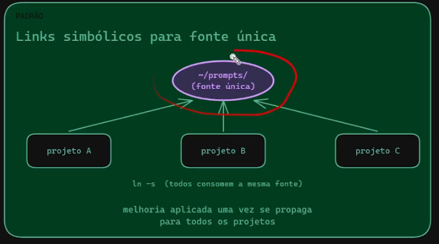
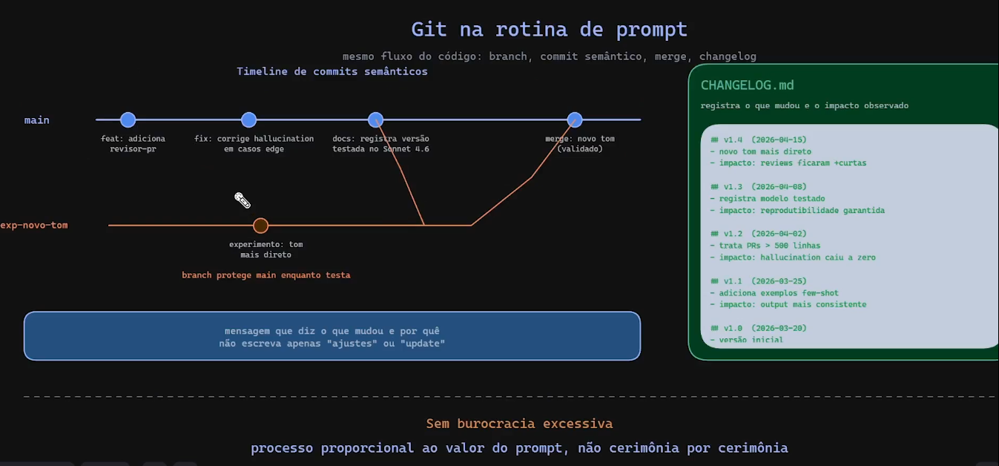

================================================================================

# Exemplo de esqueleto

Revisão nos arquivos de prompts para uso isolado, sem dependência, use Markdown, para sistemas, use yaml. Pode ser por pasta. Cada prompt pode ter uma pasta e um arquivo readme com a revisão.


---
https://github.com/fabricioveronez/prompt-registry
---


```
---
name: revisor-pr
objetivo: revisar pr grande com foco em risco
version: 1.0
model: claude-sonnet-4-6
data: 31-05-2026
tags: [code-review, backend]
quando usar: PRs acima de 200 linhas
---
```

# Revisor PR

Você é um revidor sênior. Dado o diff anexo, aponte os riscos de regressão e sugestões concretas...

================================================================================

# Exemplo de organização do repositório de prompts

## Eixo 1 

Por domínio ou função

```text
prompts/
├── code-review/
│   ├── revisor-pr.md
│   └── readme.md
├── sre/
│   ├── analista-incidente/
│   │   ├── analista-incidente.md
│   │   └── readme.md
│   └── runbook-generator/
│       ├── runbook-generator.md
│       └── readme.md
└── data/
    └── gerador-sql/
        ├── gerador-sql.md
        └── readme.md
```

## Eixo 2

Como reusar entre projetos



